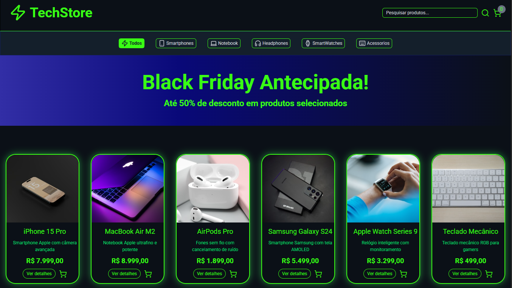
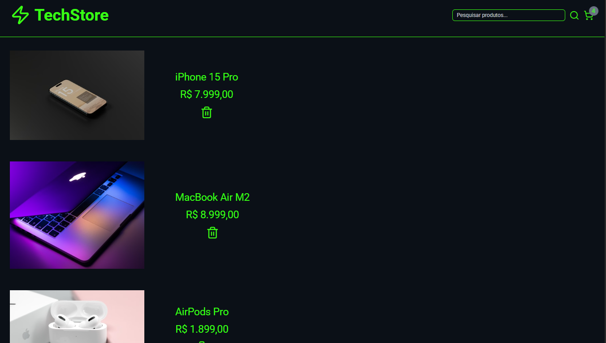
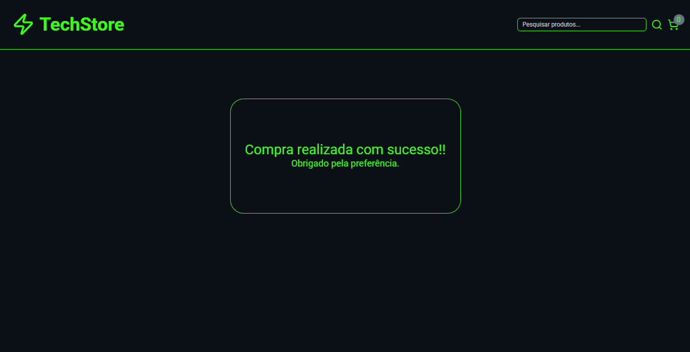

# 🛒 TechStore - E-commerce React + TypeScript


TechStore é um e-commerce **moderno e interativo** desenvolvido em React + TypeScript, com funcionalidades de **carrinho de compras, filtros dinâmicos e checkout**.  
É uma evolução de um projeto anterior em JavaScript puro, realizado por Rodolfo Mori, no bootcamp "Missão Programador do Zero". A atualização com estilização tailwind . O projeto tem previsão de escalabilidade para login com email e senha ou login com google. E banco de dados para armazenar e gerenciar os produtos, através de uma api backend. E possibilidade de implementação de stripe para realizar pagamentos online.

---

## 🔹 Demonstração

![TechStore Demo]  





---

## 🔹 Funcionalidades Principais

- 🔍 Filtragem de produtos **por categoria** ou **por nome** de forma independente  
- 🛒 Carrinho de compras com produtos selecionados  
- 📝 Página de **completar pedido** com resumo do carrinho  
- 🌐 Layout responsivo e interativo  
- ⚡ Efeitos visuais e destaque nos filtros e botões  
- 📦 Estado global usando **Context API**

---

## 🔹 Tecnologias

- **React 18 + TypeScript**  
- **Tailwind CSS** para layout e estilização  
- **Context API** para estado global  
- **React Router Dom** para navegação  
- **Lucide React** para ícones  
- Estrutura modular e reutilizável de componentes

---

## 🔹 Como Rodar Localmente

```bash
# Clonar o repositório
git clone https://github.com/seuusuario/techstore.git

# Entrar na pasta do projeto
cd techstore

# Instalar dependências
npm install

# Rodar o projeto
npm run dev

```

## Deploy na Vercel

Acessa: https://e-commerce-project-six-nu.vercel.app
